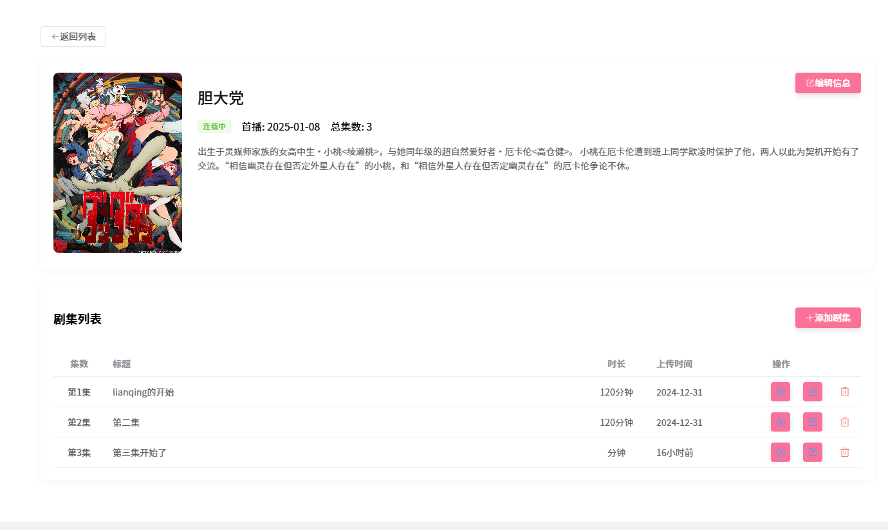

# 🎬 **弹幕视频网站介绍**

网站是一个 **动漫、视频推荐、用户互动** 于一体的综合性视频网站，致力于为用户提供高质量的视频观看体验，采用前后端分离人不分离架构开发。后端地址https://github.com/liggmxa2003/VideoWeb-Spring

在线地址∶http://129.204.224.233:8090/

------

## 📌 **核心功能**

### 1. **主页推荐**

- **用户视频**：用户可在个人中心上传视频、封面。
- **个人资料**：可编辑头像、昵称 、性别、个人介绍。
- **私聊系统**：用户给视频作者发布信息或留言。

### 2. **视频播放功能**

- **视频弹幕**：用户可发给不同颜色的弹幕。
- **互动评论**：观看视频时，用户可以进行评论互动，交流心得。
- **相关视频推荐**：播放页面展示相似内容，拓展用户观看选择。

### 3. **账号系统**

- **注册/登录**：用户可以通过邮箱快速注册和登录。
- **找回密码**：通过邮箱验证码验证，重置密码安全高效。
- **个人中心**：用户可进行关注、历史记录管理等操作。

------

## 🎨 **网站界面设计**

### **首页展示**

- 动漫主题风格，简洁而美观。
- 采用轮播图推荐热门内容，吸引用户点击观看。

### **视频播放页**

- 清晰的播放器布局，支持用户评论互动。
- 右侧展示相关视频推荐，增加观看黏性。

### **找回密码界面**

- 简洁的表单设计，通过邮箱验证码找回密码，提升用户体验与安全性。

------

## 🛠️ **技术栈**

- **前端**：Vue3+  + Pinia+ElementPlus
- **后端**：Spring Boot+Mybatis+ThradLocal
- **数据库**：MySQL
- **缓存**：[Redis](https://github.com/tporadowski/redis/releases)
- **邮箱服务**：163 网易邮箱服务
- **实时通讯**：WebSocket

------

# 开发环境

**编辑器：** **IntelliJ IDEA 2023.3.6**

**JDK：17**

**maven**：**3.5.3**

**SpringBoot：3.1.3**

**Mysql：8**

**Redis：3.21**

**vue：3**

**Node.js: 22**

## 📷 **截图展示**

## 首页

### 

## 番剧页

### 

## 播放页

### 

## 个人中心

### ****

## 个人资料

### ****

## 番剧管理页(管理员)

## 私信页

### ****

## 开发周期

- [x] 邮箱注册登陆
- [x] 找回密码
- [x] 视频发布
- [x] 视频修改
- [x] 视频删除
- [x] 用户修改
- [x] 弹幕功能
- [x] 评论功能
- [x] 私信功能
- [x] 用户关注
- [x] 管理员登陆
- [x] 发布动漫信息
- [x] 删除动漫
- [x] 编辑动漫
- [x] 新用户创建赋值新用户昵称
- [x] 管理员管理普通用户
- [x] 发布动漫集数
- [x] 修改动漫信息
- [x] 改进播放器
- [x] 视频点赞
- [x] 视频收藏
- [x] 优化注册，邮箱注册账号后随机生成账号
- [ ] 回复评论
- [ ] 用户消息提示
- [ ] OAuth三方登录(第一个里程碑目标)

